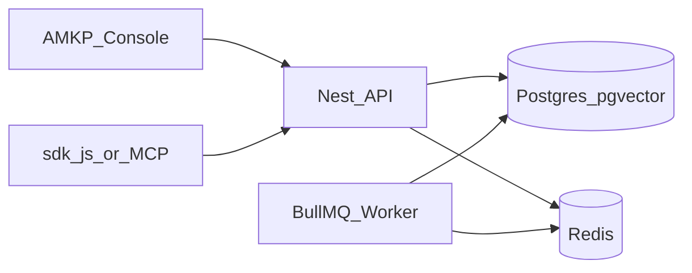

# AMKP

**Agentic Multimodal Knowledge Plane** — Evidence + Policy + Tenancy that multiple products share.

You ingest multimodal documents once. You retrieve typed **Evidence** under hard Tenant isolation. You optionally run Guarded Agentic Retrieval with budgets and traces. You do **not** rebuild a RAG stack per product, and you do **not** ship a workforce search UI.

| Surface | Who it’s for | Entry |
| --- | --- | --- |
| **AMKP Console** | Admins & Operators (human ops) | [`apps/console`](apps/console) · `pnpm dev:console` or Docker `:8080` |
| **HTTP + OpenAPI** | Integrators | `apps/api` · [`packages/openapi`](packages/openapi) |
| **TypeScript SDK** | App builders | [`packages/sdk-js`](packages/sdk-js) |
| **MCP retrieve** | Agents (Cursor / Claude) | [docs/mcp.md](docs/mcp.md) |
| **Reference app** | Two-Tenant demo | [`apps/reference-multi-product`](apps/reference-multi-product) |

**Climax of every Retrieve:** Evidence + citations + CostEstimate — not ungrounded chat.

---

## 60-second picture



Console talks to the plane **only** through `@amkp/sdk-js` (Winston). Atomic UI lives under `apps/console/src/{app,features,shared}` (Freya / ARCHITECTURE.md).

---

## Prerequisites

- **Node.js** ≥ 24.18 (LTS)
- **pnpm** 9.15.9 (`corepack enable && corepack prepare pnpm@9.15.9 --activate`)
- **Docker** + Compose (infra or full stack)

---

## Path A — Full stack in Docker (recommended demo)

Builds API, worker, migrates Prisma, serves Console on nginx with `/v1` proxied to the API.

```bash
cp .env.example .env   # set PLATFORM_ADMIN_TOKEN / AMKP_API_KEY_PEPPER for anything beyond laptop demos
pnpm docker:stack
```

| URL | What |
| --- | --- |
| http://localhost:8080 | **AMKP Console** |
| http://localhost:3000/health | API health |
| http://localhost:3000/ready | API ready (DB) |

```bash
pnpm docker:stack:logs    # follow
pnpm docker:stack:down    # stop
```

Sign in as **Platform Admin** with `PLATFORM_ADMIN_TOKEN` → create Account/Tenant → copy one-time API key → sign out → **Tenant Operator** with that key → Upload → Ask in Studio → Evidence.

> Console vault is **dev-only** (sessionStorage). Do not expose it on the public internet without a BFF / httpOnly session.

---

## Path B — Local ops (infra Docker + Node processes)

### 1. Infrastructure only

```bash
pnpm install
cp .env.example .env
pnpm docker:up            # Postgres :5433 + Redis :6379
# optional MinIO:
pnpm docker:s3
```

### 2. Migrate + build

```bash
pnpm --filter @amkp/adapters-postgres prisma:migrate
pnpm build
```

### 3. Run plane + Console

```bash
# terminal 1
pnpm dev:api

# terminal 2
pnpm dev:worker

# terminal 3 — ensure AMKP_CORS_ORIGINS includes http://localhost:5173
pnpm dev:console
```

| Process | Default |
| --- | --- |
| API | http://localhost:3000 |
| Worker health | http://localhost:3001/ready |
| Console (Vite) | http://localhost:5173 |

Set `VITE_AMKP_BASE_URL` if the API is not on `http://127.0.0.1:3000`.

---

## Scripts

| Script | What |
| --- | --- |
| `pnpm docker:up` / `docker:down` | Postgres + Redis (+ MinIO via `docker:s3`) |
| `pnpm docker:stack` / `docker:stack:down` | **Full** api + worker + migrate + console |
| `pnpm docker:stack:logs` | Tail stack logs |
| `pnpm dev:api` / `dev:worker` / `dev:console` | Hot-reload local |
| `pnpm build` / `typecheck` / `test` | Workspace quality gates |

---

## Env (high-signal)

See [`.env.example`](.env.example). Minimum for Console + stack:

| Variable | Purpose |
| --- | --- |
| `DATABASE_URL` | Postgres (host `localhost:5433` locally; `postgres:5432` in stack) |
| `REDIS_URL` | BullMQ + cache |
| `PLATFORM_ADMIN_TOKEN` | Admin Console / admin SDK |
| `AMKP_API_KEY_PEPPER` | API key hash pepper (set in shared envs) |
| `AMKP_CORS_ORIGINS` | Browser Console origins |
| `VITE_AMKP_BASE_URL` | Console → API (empty in stack = same-origin nginx proxy) |

Ops runbook: [docs/operations.md](docs/operations.md) · MCP: [docs/mcp.md](docs/mcp.md) · POC Pack: [docs/poc-pack.md](docs/poc-pack.md)

---

## Repository layout

```text
AMKP/
├── apps/
│   ├── api/                      # NestJS HTTP + MCP facade
│   ├── worker/                   # BullMQ ingest/parse
│   ├── console/                  # AMKP Console (Vite + React)
│   └── reference-multi-product/  # Two-Tenant SDK demo
├── packages/
│   ├── domain/ · application/ · adapters-* /
│   ├── sdk-js/                   # Official TypeScript SDK
│   └── openapi/
├── infra/
│   ├── docker-compose.yml        # Postgres / Redis / MinIO
│   ├── docker-compose.stack.yml  # Full deployable stack
│   ├── Dockerfile                # api + worker runtime
│   └── Dockerfile.console        # nginx SPA
└── _bmad-output/                 # SPEC, epics, stories
```

Dependency rule (AD-1): **adapters → application → domain**. Console never imports Prisma.

---

## Product contracts (read order)

1. [`_bmad-output/specs/spec-amkp/SPEC.md`](_bmad-output/specs/spec-amkp/SPEC.md) — CAP-1–8  
2. [`_bmad-output/specs/spec-amkp-console/SPEC.md`](_bmad-output/specs/spec-amkp-console/SPEC.md) — Console CAP-1–9  
3. [`ARCHITECTURE-SPINE.md`](_bmad-output/planning-artifacts/architecture/architecture-RAG-Sol-2026-07-14/ARCHITECTURE-SPINE.md)  
4. [`epics.md`](_bmad-output/planning-artifacts/epics.md)  
5. Console atomic layout: [`apps/console/ARCHITECTURE.md`](apps/console/ARCHITECTURE.md)

HTML hub (no build): [`design-artifacts/amkp-html-docs/index.html`](design-artifacts/amkp-html-docs/index.html)

---

## Status

| Ready | Deferred / hardening |
| --- | --- |
| E1–E8 plane + Console C-1–C-9 | Commercial VLM, Argon2 keys, Python sidecar |
| Docker full stack | VPC / air-gap appliance |
| SDK + OpenAPI + MCP + reference app | OpenAPI→SDK codegen |

---

## Non-goals (MVP)

- Glean-class workforce search as the product
- Generate/answer API as primary contract (BYO LLM)
- Replacing SDK/MCP with Console-only integration
- Unbounded agent loops without budgets/traces
