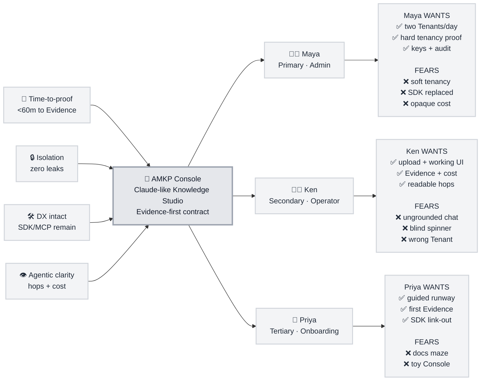

# Trigger Map Poster: AMKP Console

> Business goals ↔ user psychology for the Console product layer

**Created:** 2026-07-16  
**Author:** areesh  
**Methodology:** Effect Mapping adapted for WDS (fast-path from SPEC-amkp-console)  
**UX grammar:** Claude-like Knowledge Studio; Evidence-first contract

---

## Strategic Documents

- [01-Business-Goals.md](./01-Business-Goals.md)  
- [02-Target-Groups.md](./02-Target-Groups.md)  
- [03-Feature-Impact-Analysis.md](./03-Feature-Impact-Analysis.md)  
- [02a-persona-maya.md](./02a-persona-maya.md) · [02b-persona-ken.md](./02b-persona-ken.md) · [02c-persona-priya.md](./02c-persona-priya.md)  

---

## Vision

Humans operate AMKP through a Claude-calm studio: upload, watch the agent work, trust Evidence and cost — under hard tenancy — while SDK/MCP stay the builder path.

---

## Business Objectives

### Objective 1: Time-to-proof

- **Metric:** Minutes from sign-in to first Evidence with citations in Console  
- **Target:** &lt; 60 minutes (CAP-9)  
- **Timeline:** Console v1  

### Objective 2: Isolation confidence

- **Metric:** Cross-Tenant disclosure in UI + leak checks  
- **Target:** Zero  
- **Timeline:** Continuous  

### Objective 3: Ops adoption without DX replacement

- **Metric:** Console used for admin + retrieve debug; SDK/MCP still in production paths  
- **Target:** Console complements; no removal of DX kit  
- **Timeline:** Console v1  

### Objective 4: Agentic transparency

- **Metric:** Operator can explain router/hops/cost from Trace UI  
- **Target:** 100% of agentic Retrieves show discrete steps  
- **Timeline:** Console v1  

---

## Target Groups (Prioritized)

### 1. Maya — Platform Admin (Primary)

**Priority Reasoning:** Buys/stands up the plane; without her, no Tenants.

> Platform engineer standing up Account → Tenants → keys in a day.

**Key Positive Drivers:**

- Prove two products on one plane fast  
- Hard tenancy she can show leadership  
- Keys/audit without CLI archaeology  

**Key Negative Drivers:**

- Soft-tenancy embarrassment  
- Console that replaces SDK and locks the team in  
- Opaque agentic cost blowups  

### 2. Ken — Tenant Operator (Secondary)

**Priority Reasoning:** Daily user of Knowledge Studio; Evidence quality is the product proof.

> Operator who uploads multimodal docs, retrieves, inspects Traces/evals.

**Key Positive Drivers:**

- Claude-clear upload → working → Evidence flow  
- Citations + cost always visible  
- Trace hops as readable tool steps  

**Key Negative Drivers:**

- Chat that hallucinates without Evidence  
- Spinner with no progress  
- Wrong Tenant context  

### 3. Priya — New developer (Tertiary)

**Priority Reasoning:** Growth / onboarding success signal.

> Completes guided path to first Evidence without leaving Console.

**Key Positive Drivers:**

- Checklist that never dead-ends  
- First Evidence climax  
- Clear link out to SDK/MCP  

**Key Negative Drivers:**

- Docs-only maze  
- Feeling Console is a toy vs “real” API  

---

## Trigger Map Visualization

---

## Design Focus Statement

Design for **Ken’s Knowledge Studio climax** (upload → agent working → Evidence + cost) under **Maya’s always-visible Tenant/Admin guarantees**, with **Priya’s runway** as the guided path into that same studio.

**Primary Design Target:** Ken (Operator) — Claude-like studio  

**Must Address:**

- Evidence + citations + cost as climax (not free-form answer)  
- Active Tenant always visible  
- Upload in composer + Documents  
- Agent working steps (router / hops)  
- Admin path for Maya (Accounts, Tenants, keys, audit, health)  

**Should Address:**

- Eval board + policy cockpit  
- Onboarding checklist → first Evidence  
- Artifacts drawer for Evidence/Trace  

---

## Cross-Group Patterns

### Shared Drivers

Trust, speed-to-proof, visibility of what the system did.

### Unique Drivers

Maya: tenancy + keys. Ken: Evidence quality UX. Priya: guided confidence.

### Potential Tensions

| Tension | Resolution |
| --- | --- |
| Claude chat feel vs SPEC “no generate/answer as primary” | Shell = Claude; climax = Evidence artifacts; gloss optional secondary |
| Soft warm Claude paper vs prior cool teal ops DESIGN | Knowledge Studio uses visual-direction; Admin may keep denser tables |
| Interactive agent vs cost fear | Cost pill + hop caps always visible during working |

---

## Next Steps

- [x] Seed Brief + Trigger Map (this fast-path)  
- [ ] User approve interaction principle + focus statement  
- [ ] Phase 3 UX Scenarios (whole flows, not mockups)  
- [ ] Phase 4 page design + specs → delivery  

---

_Generated with Whiteport Design Studio framework (fast-path)_  
_Trigger Mapping credits: Effect Mapping by Balic & Domingues, adapted with negative driving forces_
