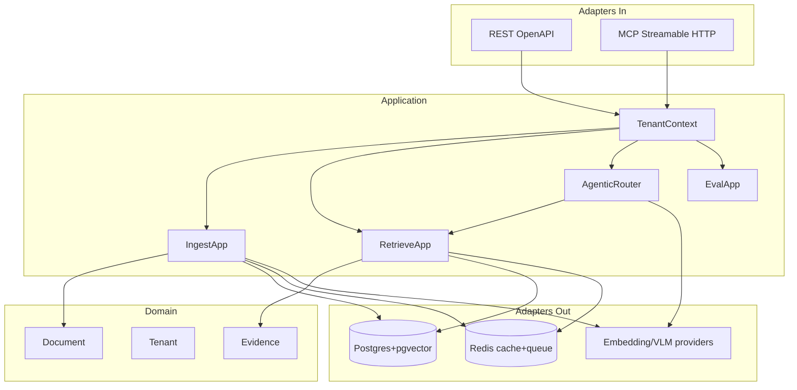
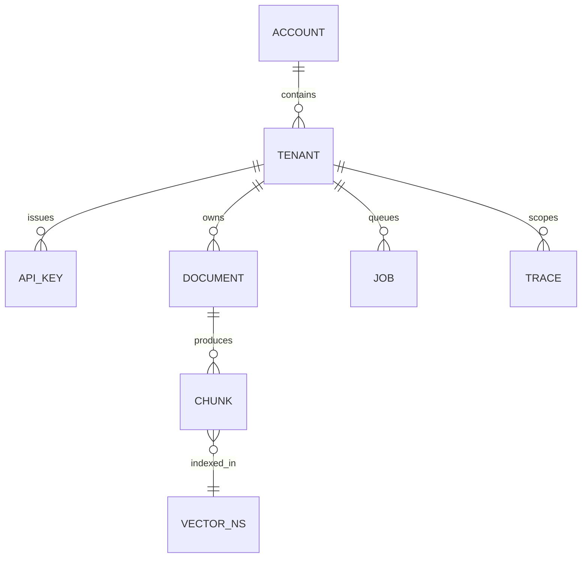
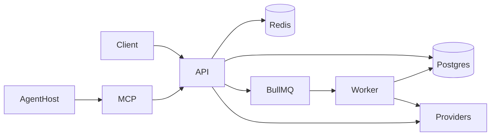

# Architecture Spine — AMKP

## Design Paradigm

**Hexagonal modular monolith.** Domain and application services own rules; adapters (HTTP, MCP, DB, queue, embedding providers) implement ports. One deployable API process + one Worker process share libraries; no second business-logic stack.



**Dependency rule:** `adapters → application → domain`. Domain never imports adapters. MCP and REST call the same application services.

## Invariants & Rules

### AD-1 — Hexagonal module boundaries

- **Binds:** all packages / CAP-1–8
- **Prevents:** epics inventing parallel frameworks or calling DB from controllers
- **Rule:** New features land as application use-cases + ports; Nest modules map 1:1 to capability areas (`tenancy`, `ingest`, `retrieve`, `agentic`, `eval`, `observability`).

### AD-2 — Tenant from auth only [ADOPTED from SPEC]

- **Binds:** CAP-1, CAP-5, CAP-8
- **Prevents:** body/header spoof of `tenant_id`
- **Rule:** Middleware resolves `TenantContext` from API key or JWT claims into AsyncLocalStorage/request scope. Application code reads only `TenantContext`. Client-supplied tenant identifiers are ignored or rejected with 403.

### AD-3 — Fail-closed Tenant data plane [ADOPTED from SPEC]

- **Binds:** CAP-2, CAP-3, CAP-5
- **Prevents:** pool-index with optional filter fail-open
- **Rule:** Each Tenant has a dedicated vector namespace/collection. Queries without resolved TenantContext must not execute. Cache keys MUST include `tenant_id`.

### AD-4 — EvidenceEnvelope is the Retrieve contract [ADOPTED from SPEC]

- **Binds:** CAP-3, CAP-4, CAP-8
- **Prevents:** chat/answer-shaped API drift across epics
- **Rule:** Public Retrieve (REST + MCP) returns versioned `EvidenceEnvelope` JSON only. No MVP generate/answer endpoint. Schema changes require version bump.

### AD-5 — Sync edge, async heavy work

- **Binds:** CAP-2, CAP-7
- **Prevents:** VLM/parse in the request thread; epic-specific job systems
- **Rule:** API accepts ingest/eval and enqueues BullMQ jobs. Workers own Parse Ladder and eval runners. Retrieve path may call embedding provider synchronously under latency budget; must record CostEstimate.

### AD-6 — Single control plane for MCP and REST

- **Binds:** CAP-8, CAP-5
- **Prevents:** MCP reimplementing retrieve/isolation
- **Rule:** MCP Streamable HTTP tools are adapters over the same application services as REST. Stateless per-request MCP (no sticky session required). Tool params cannot select Tenant.

### AD-7 — Observability is mandatory for agentic paths

- **Binds:** CAP-4, CAP-6
- **Prevents:** untraceable multi-hop spend/errors
- **Rule:** OpenTelemetry spans on auth, retrieve, each agentic hop, ingest job steps. Trace API serves persisted trace records keyed by `request_id` + TenantContext.

### AD-8 — Router defaults and budgets [ADOPTED from SPEC]

- **Binds:** CAP-4
- **Prevents:** unbounded agent loops per epic whim
- **Rule:** New Tenants: single-pass only. Agentic requires Agentic Readiness. Default `max_hops=3` and cost circuit breaker enforced in application layer (not only docs).

### AD-9 — Postgres is system of record (+ vectors MVP)

- **Binds:** CAP-1–7
- **Prevents:** split ownership of documents vs embeddings across stores without migration plan
- **Rule:** Accounts, Tenants, Documents, jobs, traces metadata, and pgvector embeddings live in PostgreSQL for MVP. Introducing Qdrant/other requires an AD update and dual-write/migration story.

### AD-10 — SaaS process topology

- **Binds:** deploy / ops envelope
- **Prevents:** each epic inventing its own deployable
- **Rule:** Two runtime roles only: `api` and `worker`, plus managed Postgres and Redis. Single-region SaaS MVP. VPC/air-gap deferred (SPEC non-goal).

## Consistency Conventions

| Concern | Convention |
| --- | --- |
| IDs | ULID/UUID v7 strings; prefix optional (`ten_`, `doc_`, `ev_`) consistently per type |
| Time | UTC ISO-8601 in APIs |
| Errors | `{ "error": { "code", "message", "request_id" } }` ; no stack traces to clients |
| Auth header | `Authorization: Bearer <api_key_or_jwt>` |
| Logging | Structured JSON; include `tenant_id`, `request_id`; never log raw Document bodies or keys |
| Config | Env via 12-factor; secrets from env/secret manager, not repo |
| Events/jobs | BullMQ queue names: `ingest`, `parse`, `eval`; payload includes `tenant_id` |
| Testing | Isolation/Leak Tests required in CI for any change touching retrieve/cache/MCP |

## Stack

| Name | Version |
| --- | --- |
| Node.js | 24.18.0 LTS |
| TypeScript | 7.0.2 |
| NestJS (`@nestjs/core`) | 11.1.28 |
| Prisma | 7.8.0 |
| PostgreSQL | 16.x (+ pgvector extension) |
| `pgvector` (npm helpers) | 0.3.0 |
| Redis | 7.x |
| BullMQ | 5.80.2 |
| OpenTelemetry SDK Node | 0.220.0 |
| MCP SDK (`@modelcontextprotocol/sdk`) | 1.29.0 |
| Package manager | pnpm (monorepo) `[ASSUMPTION]` |

## Structural Seed

```text
apps/
  api/                 # NestJS HTTP + MCP adapter
  worker/              # BullMQ consumers (parse, eval)
packages/
  domain/              # entities, EvidenceEnvelope schema
  application/         # use-cases / ports
  adapters-postgres/
  adapters-redis/
  adapters-providers/  # embeddings / VLM
  sdk-js/              # public TypeScript SDK (CAP-8)
  openapi/             # exported OpenAPI artifacts
infra/
  docker-compose.yml   # api, worker, postgres, redis
```





## Capability → Architecture Map

| Capability | Lives in | Governed by |
| --- | --- | --- |
| CAP-1 Tenancy/auth | `application/tenancy`, `api` auth middleware | AD-2, AD-3 |
| CAP-2 Ingest/Parse | `application/ingest`, `worker` parse | AD-5, AD-9 |
| CAP-3 Retrieve | `application/retrieve` | AD-3, AD-4, AD-9 |
| CAP-4 Agentic | `application/agentic` | AD-7, AD-8 |
| CAP-5 Isolation/Leak | `adapters-postgres`, CI suites | AD-3, AD-6 |
| CAP-6 Observability | OTel + `application/traces` | AD-7 |
| CAP-7 Eval/POC | `application/eval`, `worker` | AD-5 |
| CAP-8 DX surfaces | `api`, `sdk-js`, MCP adapter | AD-1, AD-4, AD-6 |

## Deferred

- Python parse/VLM worker sidecar — revisit when TS provider adapters hit quality/cost wall
- Qdrant / dedicated vector DB — revisit on measured p95/scale vs pgvector
- Multi-region / VPC / K8s topology detail — post-MVP (SPEC)
- Exact embedding/VLM vendor SKUs — provider port implementations, not spine
- Generate/answer API — SPEC non-goal
- Connector catalog — SPEC non-goal
