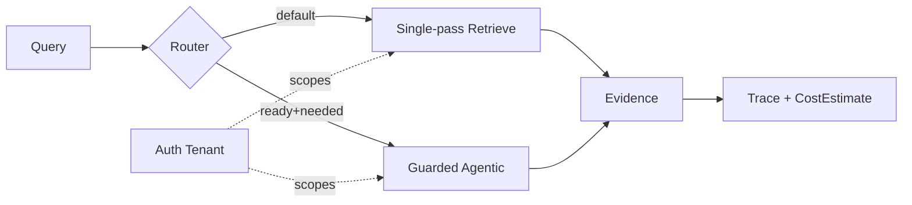

# Failure Modes (MVP must defend)

| Mode | Symptom | Required defense |
| --- | --- | --- |
| Soft tenancy | Tenant B Evidence in A response | Namespace partition + fail-closed + Leak Tests |
| Cache bleed | Shared cache serves wrong Tenant | Tenant in every cache key |
| MCP spoof | Agent passes other Tenant ID | Auth-derived Tenant only; ignore/reject body |
| Chart miss | Answer in figure, text pipeline empty | Parse Ladder + TableEvidence/page-vision tier |
| Agentic burn | Unbounded hops / cost | Router default single-pass; hop/cost budgets |
| Telephone error | Bad mid-hop poisons answer | Traces; PreferCorrectness; hop limits |
| Stale cite | Old policy version cited | Document version watermarks; prefer latest |
| Eval theater | Demo-only quality | POC Pack + golden-set runner in product |

